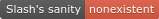

<h1 class="text-center">Swordslasher</h1>
 
 <link rel="stylesheet" href="style2.css">
<a>I am a crazy person who somehow got into coding.</a>
 
  <nav>
    <a href="http://swordslasher.com" class="nav-home"> my website </a>
 
    <a href="https://amhooman.github.io/website" class="nav-home"> my website alt link 1 </a>

    <a href="https://swordslasher.netlify.app" class="nav-home"> my website alt link 2 </a>

    <a href="https://github.com/amhooman" class="nav-home"> my github </a>
      
    <a href="https://mesacomplex.tk/404.html" class="nav-home"> my sanity </a>

    <a href="https://amhooman.github.io/website/images/spin.gif" class="nav-home"> spin </a>

  </nav>

 

 
 
my club penguin rewritten avatar. Rip.....
 

 

spin.gif has been moved to under a button

  

